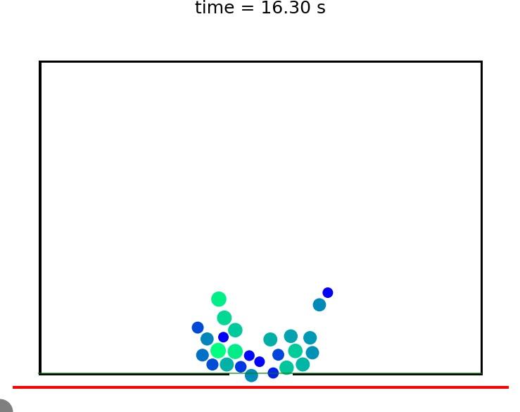
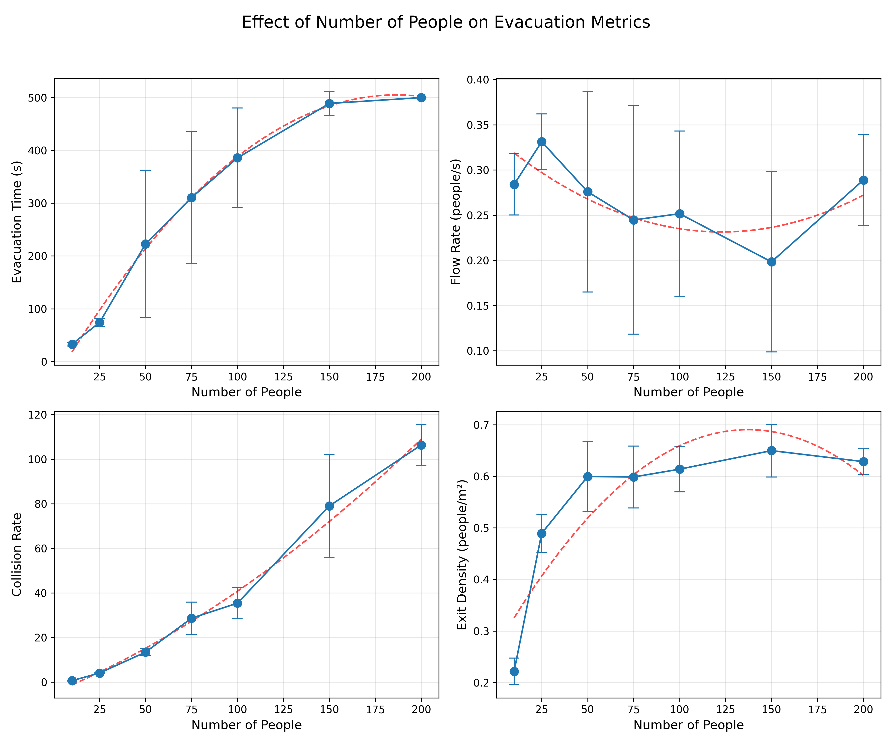
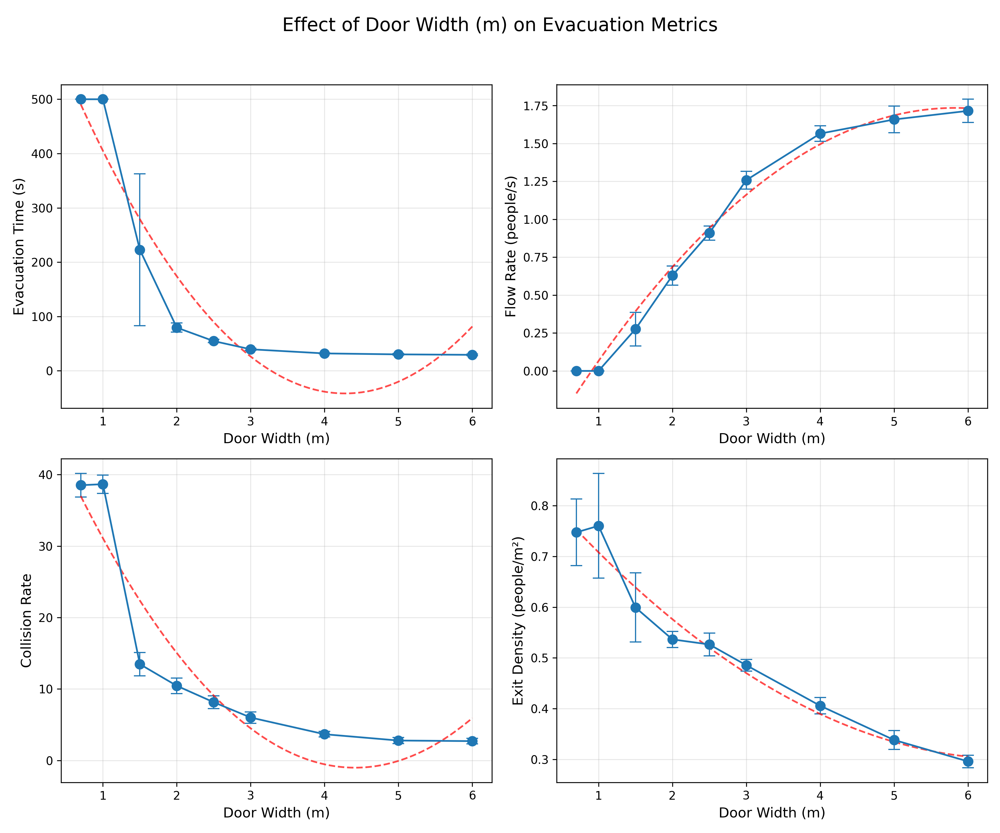
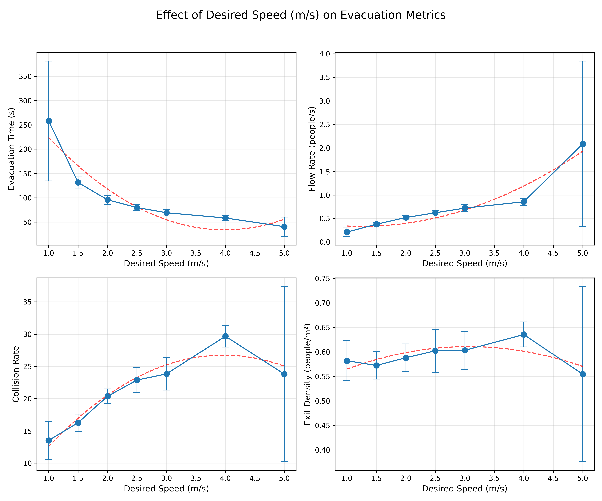

# Crowd Dynamics Simulation - Evacuation Modeling

A comprehensive mathematical modeling project for simulating crowd evacuation dynamics using the social force model. This project implements a microscopic pedestrian dynamics simulation to study how various parameters affect evacuation efficiency in a room with a single exit.

> 📄 **For detailed methodology and theoretical background**, see the [Final Report PDF](social_force_model_final_report%20copy.pdf) which provides a comprehensive explanation of the Social Force Model, mathematical formulations, and analysis methodology.



## 📋 Table of Contents

- [Overview](#overview)
- [Features](#features)
- [Installation](#installation)
- [Quick Start](#quick-start)
- [Project Structure](#project-structure)
- [Usage Examples](#usage-examples)
- [Mathematical Model](#mathematical-model)
- [Results](#results)
- [Documentation](#documentation)
- [Final Report](#final-report)

## 🎯 Overview

This project simulates pedestrian evacuation from a room using a social force model. The simulation tracks individual agents as they navigate toward an exit, accounting for:

- **Social forces**: Repulsion between pedestrians and between pedestrians and walls
- **Desired velocity**: Each agent moves toward the exit at their preferred speed
- **Relaxation dynamics**: Agents adjust their velocity over time
- **Physical constraints**: Collision detection and avoidance

The simulation provides detailed metrics including evacuation time, flow rate, collision frequency, and exit density, enabling comprehensive analysis of evacuation scenarios.

## ✨ Features

- **Flexible Domain Design**: Configurable room geometry with adjustable door width
- **Parameter Sweep Analysis**: Systematic exploration of parameter space
- **Real-time Visualization**: Animated simulations with frame-by-frame output
- **Comprehensive Metrics**: 
  - Evacuation time
  - Flow rate (people/second)
  - Collision frequency
  - Exit density
- **Statistical Analysis**: Multiple simulation runs with statistical aggregation
- **Animation Generation**: Automatic creation of MP4 videos from simulation frames

## 🚀 Installation

### Prerequisites

- Python 3.7 or higher
- NumPy
- Matplotlib
- [Cromosim](https://github.com/cromosim/cromosim) library
- FFmpeg (optional, for animation generation)

### Setup

1. Clone or download this repository:
```bash
cd final_project_math_modeling
```

2. Install required Python packages:
```bash
pip install -r requirements.txt
```

Alternatively, install individually:
```bash
pip install numpy matplotlib cromosim
```

3. (Optional) Install FFmpeg for animation generation:
   - macOS: `brew install ffmpeg`
   - Linux: `sudo apt-get install ffmpeg`
   - Windows: Download from [ffmpeg.org](https://ffmpeg.org/download.html)

## 🏃 Quick Start

### Running a Single Simulation

Navigate to the `sim_visualisation` directory and run:

```bash
cd sim_visualisation
python single_simulation.py
```

This will create a simulation with default parameters (50 people, 1.2 m/s desired speed, 5m door width) and generate visualization frames.

### Running Parameter Sweeps

Navigate to the `enhanced_sim` directory:

```bash
cd enhanced_sim
python parameter_sweep_simulation.py
```

Modify the `parameter_ranges` dictionary in the script to test different parameters.

## 📁 Project Structure

```
final_project_math_modeling/
├── README.md                          # This file
├── DOCUMENTATION.md                   # Comprehensive documentation
├── requirements.txt                   # Python dependencies
├── enhanced_sim/                      # Parameter sweep simulations
│   ├── parameter_sweep_simulation.py # Main parameter sweep script
│   └── results_*/                     # Parameter sweep results
├── sim_visualisation/                 # Visualization and single simulations
│   ├── single_simulation.py          # Single simulation runner
│   ├── create_animation.py           # Animation generator
│   ├── room_domain.png               # Domain visualization
│   └── results_*/                    # Simulation output directories
└── tests_and_trials/                  # Development and testing scripts
```

## 💡 Usage Examples

### Example 1: Single Simulation with Custom Parameters

```python
from sim_visualisation.single_simulation import run_single_simulation

metrics = run_single_simulation(
    num_people=100,
    desired_speed=1.5,
    repulsion_strength=2500.0,
    relaxation_time=0.3,
    door_width=3.0,
    Tf=120.0
)

print(f"Evacuation time: {metrics['evacuation_time']} seconds")
```

### Example 2: Parameter Sweep

```python
from enhanced_sim.parameter_sweep_simulation import run_parameter_sweep

parameter_ranges = {
    'num_people': [10, 25, 50, 75, 100],
    'door_width': [1.5, 2.5, 5.0, 7.5, 10.0]
}

results = run_parameter_sweep(parameter_ranges, repetitions=5)
```

## 🔬 Mathematical Model

The simulation implements the **Social Force Model** for pedestrian dynamics. The key equations are:

### Velocity Update
\[
\mathbf{u}(t + \Delta t) = \Delta t \frac{\mathbf{v}_d - \mathbf{u}_{old}}{\tau} + \mathbf{u}_{old} + \Delta t \frac{\mathbf{F}}{m}
\]

Where:
- \(\mathbf{u}\) = current velocity
- \(\mathbf{v}_d\) = desired velocity (toward exit)
- \(\tau\) = relaxation time
- \(\mathbf{F}\) = total social force
- \(m\) = pedestrian mass

### Social Forces

**Pedestrian-Pedestrian Repulsion:**
\[
\mathbf{F}_{ij} = F \exp\left(-\frac{d_{ij} - (r_i + r_j)}{\delta}\right) \mathbf{n}_{ij}
\]

**Pedestrian-Wall Repulsion:**
\[
\mathbf{F}_{iw} = F \exp\left(-\frac{d_{iw} - r_i}{\delta}\right) \mathbf{n}_{iw}
\]

Where:
- \(F\) = repulsion strength
- \(d_{ij}\) = distance between pedestrians
- \(r_i, r_j\) = pedestrian radii
- \(\delta\) = interaction range
- \(\mathbf{n}\) = normalized direction vector

For more details, see [DOCUMENTATION.md](DOCUMENTATION.md).

## 📊 Results

### Sample Simulation Outputs

The project includes extensive parameter sweep results. Here are some example visualizations:

#### Parameter Sweep: Number of People


#### Parameter Sweep: Door Width


#### Parameter Sweep: Desired Speed


### Key Findings

- **Evacuation time** increases non-linearly with the number of people
- **Door width** has a significant impact on flow rate, with diminishing returns beyond ~5m
- **Desired speed** affects evacuation time, but very high speeds can increase collisions
- **Relaxation time** influences how quickly agents respond to obstacles

### Example Simulation Frames

The simulation generates frame-by-frame visualizations showing the evacuation process:

#### Early Stage (t ≈ 2.9s)


#### Mid Stage (t ≈ 13.2s)


#### Late Stage (t ≈ 16.3s)


## 📚 Documentation

For detailed documentation including:
- Complete mathematical model description
- Parameter explanations
- Code architecture
- Analysis methodology
- Troubleshooting

See [DOCUMENTATION.md](DOCUMENTATION.md).

**📄 Final Report**: The [Final Report PDF](social_force_model_final_report%20copy.pdf) contains the complete theoretical background, methodology, and analysis of the Social Force Model implementation used in this project.

## 📄 Final Report

The project includes a comprehensive final report that details:

- **Theoretical Foundation**: Complete explanation of the Social Force Model
- **Mathematical Formulations**: Detailed equations and derivations
- **Methodology**: Implementation approach and parameter selection
- **Analysis**: Results interpretation and findings
- **Discussion**: Insights and implications for evacuation planning

Access the report: [social_force_model_final_report copy.pdf](social_force_model_final_report%20copy.pdf)

## 🔧 Configuration Parameters

### Key Simulation Parameters

| Parameter | Description | Default | Range |
|-----------|-------------|---------|-------|
| `num_people` | Number of pedestrians | 50 | 1-200 |
| `desired_speed` | Preferred walking speed (m/s) | 1.2 | 0.5-5.0 |
| `repulsion_strength` | Force strength (N) | 2000.0 | 100-5000 |
| `relaxation_time` | Velocity adjustment time (s) | 0.5 | 0.1-5.0 |
| `door_width` | Exit width (m) | 5.0 | 1.0-12.0 |

### Physical Constants

- **Mass**: 80 kg (average human)
- **Radius**: 0.4-0.6 m (uniform distribution)
- **Time step**: 0.005 s
- **Interaction range**: 0.1 m

## 🎬 Creating Animations

After running a simulation, create an animation:

```python
from sim_visualisation.create_animation import create_animation_from_frames

create_animation_from_frames(
    prefix="results_50p_5dw_1.2sp/",
    domain_name="room",
    fps=10
)
```

This generates an MP4 file showing the evacuation process.

## 📈 Analysis Workflow

1. **Define Parameters**: Choose parameter ranges for investigation
2. **Run Simulations**: Execute parameter sweeps with multiple repetitions
3. **Collect Metrics**: Analyze evacuation time, flow rate, collisions, density
4. **Visualize Results**: Generate plots and animations
5. **Interpret Findings**: Understand parameter effects on evacuation efficiency

## 🤝 Contributing

This is an academic project for Mathematical Modeling coursework. For questions or improvements, please refer to the course guidelines.

## 📝 License

This project is part of academic coursework. Please respect academic integrity guidelines.

## 🙏 Acknowledgments

- Built using the [Cromosim](https://github.com/cromosim/cromosim) library
- Based on the Social Force Model by Helbing and Molnár (1995)
- Developed for Y2S2 Mathematical Modeling course

---

**Note**: This project requires the Cromosim library. Ensure it is properly installed before running simulations.

